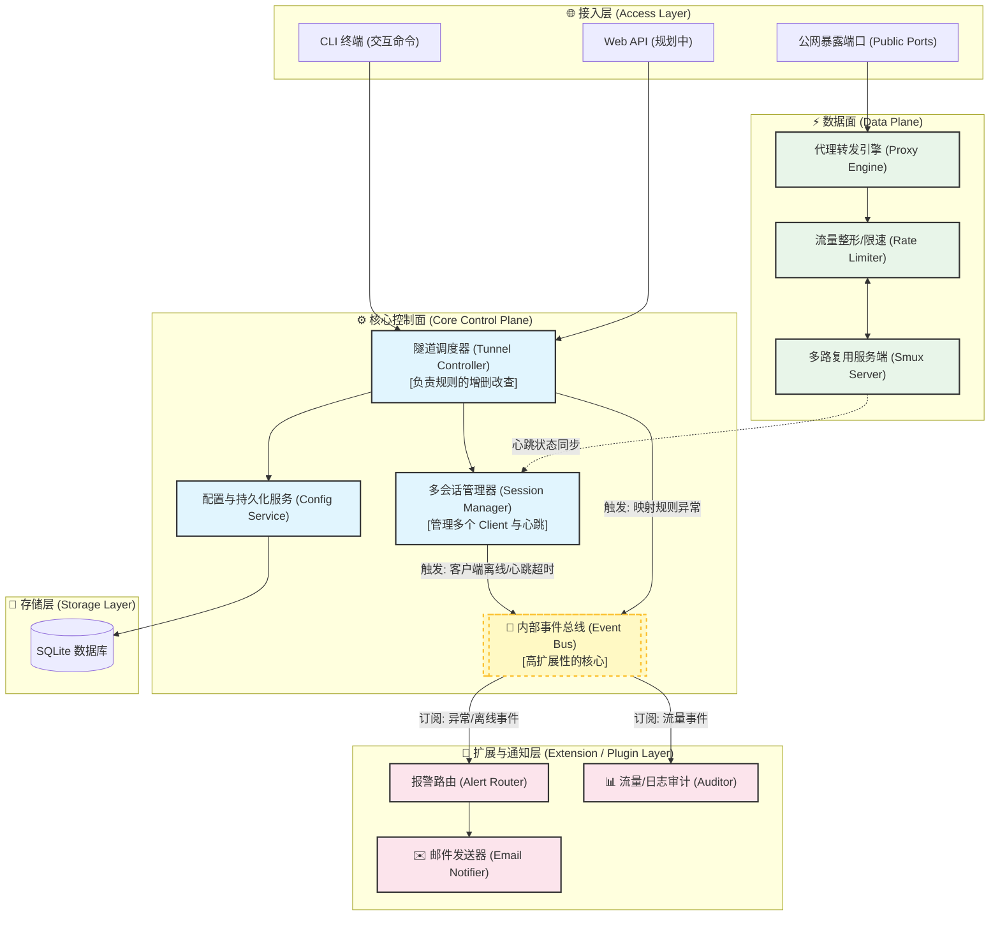

# Gotaxy 架构设计

Gotaxy 是一款基于 Go 语言实现的高性能、事件驱动的企业级内网穿透网关。
本设计文档描述了系统在 v0.3.0 重构后的整体架构和各个核心组件。

## 1. 核心架构设计 (Event-Driven Architecture)

系统采用了**事件驱动架构 (EDA)** 结合 **分层架构 (Layered Architecture)**，将“数据流”与“控制流”进行严格分离。



## 2. 项目目录结构

重构后的目录结构高度对齐了架构分层：

```text
gotaxy/
├── cmd/                     // 主程序入口
│   ├── server/              // 服务端启动入口 (注入所有依赖)
│   └── client/              // 客户端启动入口
├── data/                    // SQLite 数据库文件 (运行时生成)
├── docs/                    // 文档说明
├── internal/                // 核心逻辑代码
│   ├── alert/               // [扩展层] 报警路由与通知插件 (Email等)
│   ├── client/              // [客户端] 客户端核心逻辑
│   ├── config/              // [控制面] 配置读取与初始化
│   ├── core/                // [控制面] 服务端核心状态容器 (GotaxyServer)
│   ├── eventbus/            // [通信层] 内部事件总线 (Pub/Sub)
│   ├── inits/               // [基础组件] 数据库、日志等资源初始化
│   ├── session/             // [控制面] 多客户端与会话管理 (Session Manager)
│   ├── shell/               // [接入层] 交互式 CLI 终端
│   ├── storage/             // [存储层] SQLite 数据库模型
│   └── tunnel/              // [数据面/控制面] 隧道调度(Controller)与代理(Proxy)
├── logs/                    // 日志输出目录 (运行时生成)
├── pkg/                     // 公共工具库
│   ├── email/               // SMTP 邮件发送组件
│   ├── logger/              // 日志滚动组件
│   ├── tlsgen/              // TLS 证书生成组件
│   └── utils/               // 基础工具函数
└── ...
```

## 3. 核心模块说明

### 3.1 `internal/core` (GotaxyServer)
系统的大脑。它取代了以前耦合严重的全局变量，通过**依赖注入**的方式将 `EventBus`、`SessionManager`、`DB` 等组件组装在一起，传递给各个子系统使用。

### 3.2 `internal/eventbus` (内部事件总线)
解耦的关键。系统内的异步操作（如流量统计上报、客户端掉线通知）全部通过 `Publish/Subscribe` 机制流转，核心转发线程（Data Plane）永远不会被慢速操作（如发邮件）阻塞。

### 3.3 `internal/session` (多会话管理器)
负责管理所有连接上来的客户端会话 (`ClientSession`) 以及映射规则 (`Mapping`)。支持多租户/多客户端接入。

### 3.4 `internal/tunnel` (数据面与隧道调度)
- **Controller**: 负责监听控制端口（默认 9000），进行 mTLS 认证，并建立 Smux 多路复用隧道。同时负责维护对客户端的心跳检测。
- **Proxy**: 纯粹的数据搬运工。它根据映射规则启动公网监听，并在请求到来时分配限速器 (Rate Limiter)，通过 Smux Stream 将数据透明转发至内网。

### 3.5 `internal/alert` (报警路由)
扩展层的代表。它通过订阅 EventBus 中的 `EventClientDisconnected` 事件，当客户端掉线时自动触发邮件通知，实现了真正的“热插拔”。