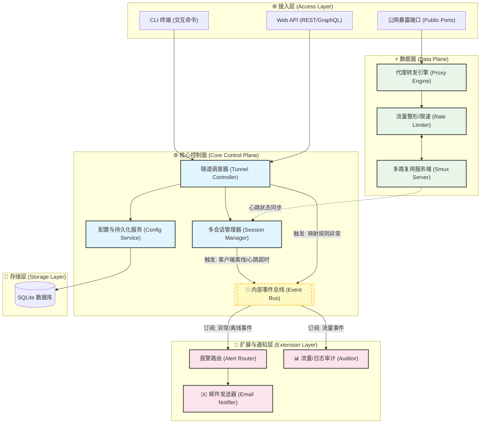

# Gotaxy v0.3.0 架构重构设计文档

## 1. 重构背景与痛点分析
当前版本的 Gotaxy 在实现基础内网穿透功能上已经完备，但随着项目演进，暴露出了以下架构上的痛点，难以支撑后续的复杂需求：
- **全局变量泛滥与强耦合**：`internal/global` 模块持有了过多的核心状态（`Ctx`, `ConnPool`, `DB`, `Config` 等），导致代码难以测试、模块边界模糊。
- **单客户端连接限制**：当前的连接池（`Pool`）使用单例模式（`atomic.Value` 存储 `currentSession`），后连接的客户端会覆盖之前的会话，无法支持多租户/多节点同时接入。
- **控制面与数据面混杂**：业务逻辑和网络转发逻辑互相交织，修改心跳等逻辑会影响核心转发流程。
- **扩展性差（硬编码通知逻辑）**：如果在心跳超时等场景需要发送邮件报警，按当前架构需要侵入核心心跳检测代码，无法实现“热插拔”。

## 2. v0.3.0 重构目标
为解决以上痛点，v0.3.0 版本的重构目标确立如下：
1. **消除 Global 全局状态**：引入 `GotaxyServer` 与 `GotaxyClient` 核心结构体，通过依赖注入管理模块。
2. **支持多客户端接入**：升级 `SessionPool` 为 `SessionManager`，以 `ClientID` 为维度管理多个并发连接。
3. **引入事件驱动架构 (Event-Driven)**：引入 `EventBus` 内部事件总线，实现控制面、数据面、通知面的解耦。
4. **实现插件化报警（邮件通知）**：基于事件总线，无侵入式接入邮件报警模块。
5. **清晰的分层边界**：接入层（UI/CLI）、控制面（Control Plane）、数据面（Data Plane）与扩展层（Extension）严格分离。

## 3. 全新架构设计图
重构后，系统将演变为基于事件驱动的分层架构。



## 4. 核心模块与组件设计

### 4.1 核心服务结构体
告别 `internal/global`，采用实例化对象模型：
```go
// GotaxyServer 核心服务端结构
type GotaxyServer struct {
    EventBus   *eventbus.EventBus
    ConfigMgr  *config.Manager
    SessionMgr *session.Manager
    TunnelCtrl *tunnel.Controller
    Storage    *storage.SQLiteStore
}
```

### 4.2 内部事件总线 (EventBus)
所有跨模块的异步操作和通知将通过事件总线进行通信，事件结构示例：
```go
type EventType string

const (
    EventClientConnected    EventType = "CLIENT_CONNECTED"
    EventClientDisconnected EventType = "CLIENT_DISCONNECTED"
    EventTunnelError        EventType = "TUNNEL_ERROR"
    EventTrafficReport      EventType = "TRAFFIC_REPORT"
)

type Event struct {
    Type      EventType
    Timestamp time.Time
    Payload   interface{}
}
```

### 4.3 会话管理器 (SessionManager)
取代原有的 `Pool`，支持多客户端（通过分配 ClientID 或者 Token 识别）：
```go
type Manager struct {
    sessions map[string]*ClientSession // key: ClientID
    mu       sync.RWMutex
}
```

### 4.4 报警路由与邮件插件 (AlertRouter & EmailNotifier)
基于事件订阅，无侵入式接入系统：
```go
func (a *AlertRouter) Start(bus *eventbus.EventBus) {
    bus.Subscribe(EventClientDisconnected, func(e Event) {
        payload := e.Payload.(*ClientDisconnectedPayload)
        // 调用邮件发送器
        email.SendAlert("客户端掉线报警", fmt.Sprintf("客户端 %s 于 %v 掉线", payload.ClientID, e.Timestamp))
    })
}
```

## 5. 重构实施路径规划 (Roadmap)

### Phase 1: 基础设施搭建 (Infrastructure)
1. 设计并实现 `internal/eventbus` 包，提供基本的发布/订阅 (Pub/Sub) 能力。
2. 梳理并在 `pkg/models` 或 `internal/events` 中定义核心事件枚举（如 `ClientOfflineEvent`, `TunnelErrorEvent` 等）。

### Phase 2: 核心模块解耦 (Decoupling)
1. 移除 `internal/global`。
2. 重写 `cmd/server/server.go` 初始化流程，采用依赖注入方式构建 `GotaxyServer`。
3. 将 `internal/pool` 升级为 `internal/session` (Session Manager)，支持 `map[string]*Session` 多客户端管理。

### Phase 3: 数据面重塑 (Data Plane Refactoring)
1. 将 `internal/tunnel/proxy` 和 `serverCore` 分离为独立的 Controller 与 Proxy Engine。
2. 将原先写死在 Proxy 中的限速和流量统计逻辑，调整为通过 `EventBus` 定时广播流量事件，让外层审计模块接收处理。

### Phase 4: 扩展层与邮件报警接入 (Extension & Alerting)
1. 新建 `internal/alert` 报警模块，包含 `AlertRouter`。
2. 完善 `pkg/email` 的实现（结合配置模块读取 SMTP 账号信息）。
3. 注册报警模块并订阅 `EventClientDisconnected` 等异常事件，完成邮件报警。

### Phase 5: CLI 层适配与集成测试 (Integration)
1. 重构 `internal/shell` 逻辑，使其通过调用 `GotaxyServer` 暴露的接口（如 `server.TunnelCtrl.AddMapping()`）工作，而非直接操作全局变量和数据库。
2. 进行全流程的联调测试（包括多客户端并发、心跳超时重连、报警邮件投递、限流等）。
